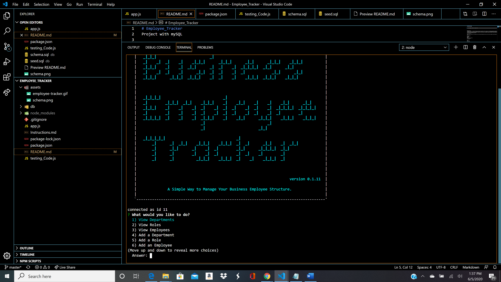

# Employee_Tracker
Project with mySQL

Project Title
Employee Tracker is a prompt based node application that helps the User create his own Employee database dynamically in MySQL.
The application will start with a prompt of serveral options such as: Viewing your current Departments Viewing your current Roles Viewing your current Employees Adding New Departments Adding new Roles Adding new Employees Updating Employees Removing Departments Removing Roles Removing Employees Quit application feature

Getting Started
You can get a verison of this product up and running through heroku and can see the juicy backend code through the github
page.

Prerequisites
Install
Inquirer 
MySQL 
Console-Table-Printer 
Asciiart-Logo

Deployment
Node

Try Me Live
Fork Repo and run node app.js in console

Built With
Node
JS
Inquirer 
MySQL 
Console-Table-Printer 
Asciiart-Logo

Authors
Wadih Ojeil- Full Stack Web Developer

License
This project is licensed under the MIT License

## Purpose and Inspiration
An application that will generate your whole employee management system in MySql through inquirer in Node.
Follow up and manage your own business.

## Tech Stack

+ [NODE](https://nodejs.org/en/)

#### Install and run
Install all the dependencies with NPM
`npm install`  
Then start the project
`node app.js`

